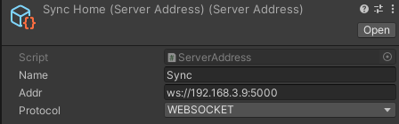
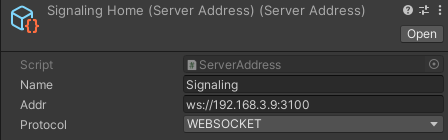

# VR_Classroom
Online classes in VR space using Websocket and WebRTC

## Feature
- Combination of WebSocket and WebRTC according to the importance of messages in communication
- Hand tracking support  
- WebView support  
- Download object from external server (using AssetBundle)  
- Control of object sharing from the teacher's side  
- Support for bHaptics tactile gloves  

## Note
<details><summary>please see here</summary>

- Since ``` 28a838d ```, we have changed to manage libraries in projects by submodules. This may cause problems with git pulls for users who cloned the repository before ``` 28a838d ```. In that case, please consider cloning a new repository, also, if you pull changes in the future, please run ``` git submodule update --init ``` to update the submodule to the version recommended by the project.
- The Oculus SDK has now been updated for Oculus integration SDK to Meta XR All in One SDK, this sdk requires Unity Editor 2021.26f1 ~.

</details>

## Documentation
[click here (hackmd)](https://hackmd.io/4d4vad8jT_igwNi_5GZrEQ)

## Screenshot
[](https://www.youtube.com/watch?v=SZBbz0wVcFc)  
<table>
	<tr>
		<td> 
	  
	 	</td>
	  <td> 
  		
	  </td>
		<td> 
			
		</td>
	</tr>
</table>

## Getting Started
### Prerequisites
#### Unity Editor
- Unity 2021.3.37f1 (meta xr sdk requires Unity Editor 2021.26f1 ~.)  
#### Package Manager and Asset Store
- [meta-xr-all-in-one-sdk](https://assetstore.unity.com/packages/tools/integration/meta-xr-all-in-one-sdk-269657)  
- [SDF Toolkit](https://assetstore.unity.com/packages/tools/utilities/sdf-toolkit-free-50191)  
- [ProBuilder](https://github.com/Unity-Technologies/com.unity.probuilder.git)  
- [bHaptics](https://assetstore.unity.com/packages/tools/integration/bhaptics-haptic-plugin-76647)  
- [unity.webrtc](https://github.com/Unity-Technologies/com.unity.webrtc)  
- [NativeWebsocket](https://github.com/endel/NativeWebSocket)
- node (v16.15.0)  

### Installing
Clone the repository to any directory with the following command  
```
git clone https://github.com/TLabAltoh/VR_Classroom.git --recursive
```

### Project Set Up
- Build Settings

| Property      | Value   |
| ------------- | ------- |
| Platform      | Android |

- Project Settings

| Property          | Value                                 |
| ----------------- | ------------------------------------- |
| Color Space       | Linear                                |
| Graphics          | OpenGLES3                             |
| Minimum API Level | 29                                    |
| Target API Level  | 30 (Unity 2021), 31 ~ 32 (Unity 2022) |


- Add the following symbols to Project Settings --> Player --> Other Settings (to be used at build time)


```
UNITYWEBVIEW_ANDROID_SUPPORT_OCULUS
```
```
UNITYWEBVIEW_ANDROID_USES_CLEARTEXT_TRAFFIC
```
```
UNITYWEBVIEW_ANDROID_ENABLE_CAMERA
```
```
UNITYWEBVIEW_ANDROID_ENABLE_MICROPHONE
```

- XR Plug-in Management

| Property        | Value               |
| --------------- | ------------------- |
| Plugin Provider | Oculus (not OpenXR) |

## Server Set Up

1. Set the SignalingServer and SyncServer addresses in Unity
<table>
<tr>
   <td> 
      
   </td>
</tr>
   <td> 
      
   </td>
   <td> 
      
   </td>
</table>

2. Execute the following commands in ```TLabNetworkedVR-Server/SyncServer```

```
npm start
```

or  

```
start.bat
```

3. Execute the following commands in ```TLabNetworkedVR-Server/WebRTCSignaling```

```
npm start
```

or  

```
start.bat
```

### How to play
#### Enter Room
- Host
```
{IP Address (default 192.168.3.11} -p {Password (default 1234)}
```
- Guest
```
{IP Address (default 192.168.3.11)}
```
#### Controller
- IndexTrigger: Select UI
- handTrigger: Manipulating objects in the scene (grip, expand)
#### HandTracking
- Pinch of index finger and thumb: Select UI
- Hand-holding gesture: Manipulating objects in the scene (grip, expand)

## System Design Overview
### Network
<table>
	<tr>
  	 <td> 
    	  
	   </td>
  	 <td> 
    	  
	   </td>
	</tr>
</table>
