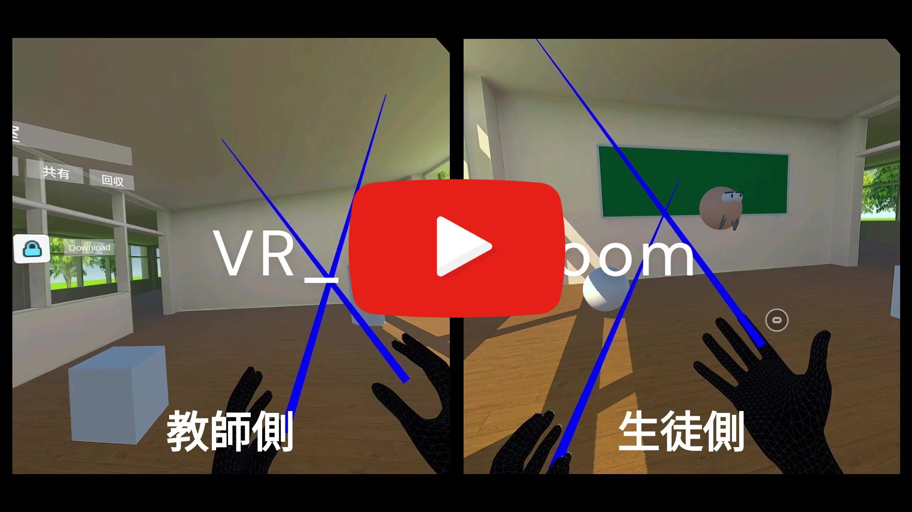
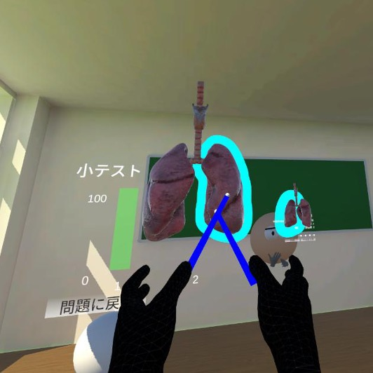
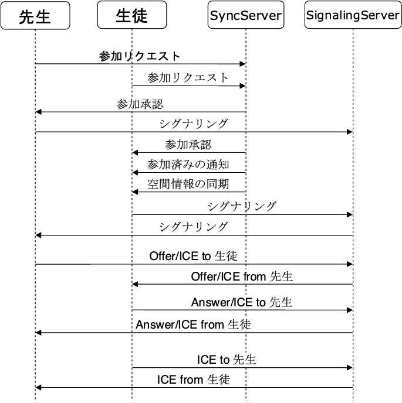
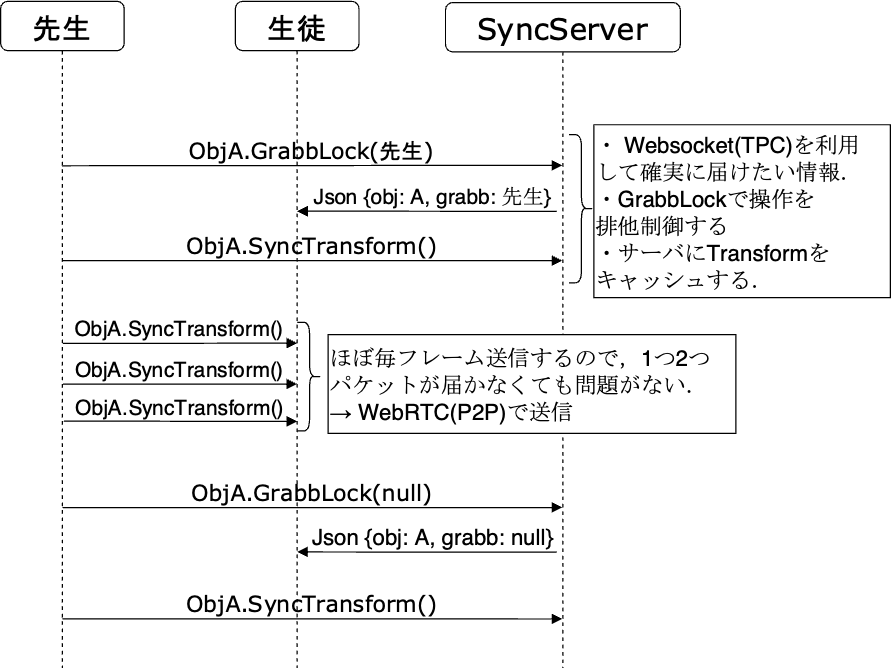
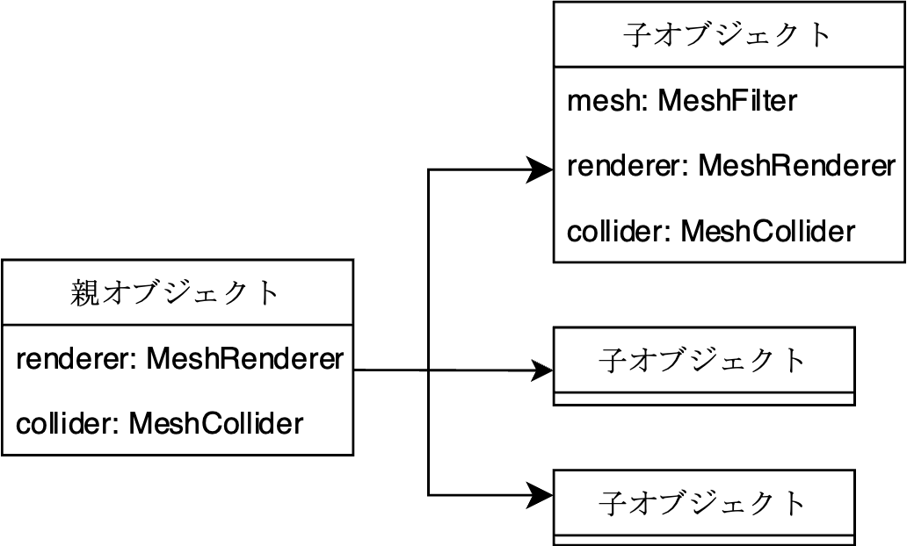

# VR_Classroom
Online classes in VR space using Websocket and WebRTC

## Feature
- Combination of WebSocket and WebRTC according to the importance of messages in communication
- Hand tracking support  
- Support for bHaptics tactile gloves  
- WebView support (Android builds only)  
- Download object from external server (using AssetBundle)  
- Control of object sharing from the teacher's side  

## Documentation
[click here (hackmd)](https://hackmd.io/4d4vad8jT_igwNi_5GZrEQ)

## Screenshot
[](https://www.youtube.com/watch?v=SZBbz0wVcFc)  
<table>
<tr>
   <td> 
      
   </td>
   <td> 
      
   </td>
</tr>
</table>

<table>
<tr>
   <td> 
      
   </td>
   <td> 
      
   </td>
</tr>
</table>

<table>
<tr>
   <td> 
      
   </td>
</tr>
</table>

## Getting Started
### Prerequisites
- Unity 2021.3.23f1  
- Oculus Integration (Install from asset store)  
- ProBuilder (Install from asset store)  
- Android Logcat (Install from upm)  
- [Unity-UI-Rounded-Corners](https://github.com/kirevdokimov/Unity-UI-Rounded-Corners.git)  
- [SDF Toolkit](https://assetstore.unity.com/packages/tools/utilities/sdf-toolkit-free-50191)  
- node (v16.15.0)  
- [bHaptics](https://assetstore.unity.com/packages/tools/integration/bhaptics-haptic-plugin-76647)
- [NativeWebsocket](https://github.com/endel/NativeWebSocket)

### Installing
Clone the repository to any directory with the following command  
```
git clone https://github.com/TLabAltoh/VR_Kensyu.git
```

### Set up
1. Execute the following commands in Server/SyncServer
```
npm start
```
2. Execute the following commands in Server/WebRTCSignaling
```
npm start
```

3. Set the SignalingServer and SyncServer addresses in Unity
<table>
<tr>
   <td> 
      
   </td>
   <td> 
      
   </td>
</tr>
</table>
4. Launch the game from UnityEditor or the built file

### How to play
#### Enter Room
- Host
```
{IP Address (default 192.168.3.11} -p {Password (default 1234)}
```
- Guest
```
{IP Address (default 192.168.3.11)}
```
#### Controller
- IndexTrigger: Select UI
- handTrigger: Manipulating objects in the scene (grip, expand)
#### HandTracking
- Pinch of index finger and thumb: Select UI
- Hand-holding gesture: Manipulating objects in the scene (grip, expand)

## System Design Overview
### Network
<table>
<tr>
   <td> 
      
   </td>
   <td> 
      
   </td>
</tr>
</table>

### Object Divide
<table>
<tr>
   <td> 
      
   </td>
</tr>
</table>
