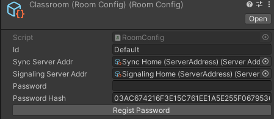

# VR_Kensyu
Remote teaching project for use in VR using Unity, WebSocket, and WebRTC  

## Feature
- Combination of WebSocket and WebRTC according to the importance of messages in communication
- Hand tracking support  
- Support for bHaptics tactile gloves  
- WebView support (Android builds only)  
- Download object from external server (AssetBundle)  
- Control of object sharing from the teacher's side  

## Screenshot
  
  
  


## Getting Started

### Prerequisites
- Unity 2021.3.23f1  
- Oculus Integration (Install from asset store)  
- ProBuilder (Install from asset store)  
- Android Logcat (Install from upm)  
- node (v16.15.0)  
- [bHaptics](https://assetstore.unity.com/packages/tools/integration/bhaptics-haptic-plugin-76647)
- [NativeWebsocket](https://github.com/endel/NativeWebSocket)
- [TLabVRGrabber](https://github.com/TLabAltoh/TLabVRGrabber)
- [TLabVKeyborad](https://github.com/TLabAltoh/TLabVKeyborad)
- [TLabWebView](https://github.com/TLabAltoh/TLabWebView)
- [TLabVRPlayerController](https://github.com/TLabAltoh/TLabVRPlayerController)

### Installing
Clone the repository to any directory with the following command  
```
git clone https://github.com/TLabAltoh/VR_Kensyu.git
```
Execute the following commands in the cloned project (install necessary submodules)

```
git submodule init
git submodule update
```

### Start Server
Set up a server to synchronize worlds
1. Execute the following commands from the Server/SyncServer/ and Server/WebRTCSignaling/
```
npm start
```

  
  
2. Set the SignalingServer and SyncServer addresses in Unity (ports 3001, 5000), then set the addresses for each component using the SetServerAddr button
3. Launch the game from UnityEditor or the built file

### How to play
#### Controller
- IndexTrigger: Select UI
- handTrigger: Manipulating objects in the scene (grip, expand)
#### HandTracking
- Pinch of index finger and thumb: Select UI
- Hand-holding gesture: Manipulating objects in the scene (grip, expand)
